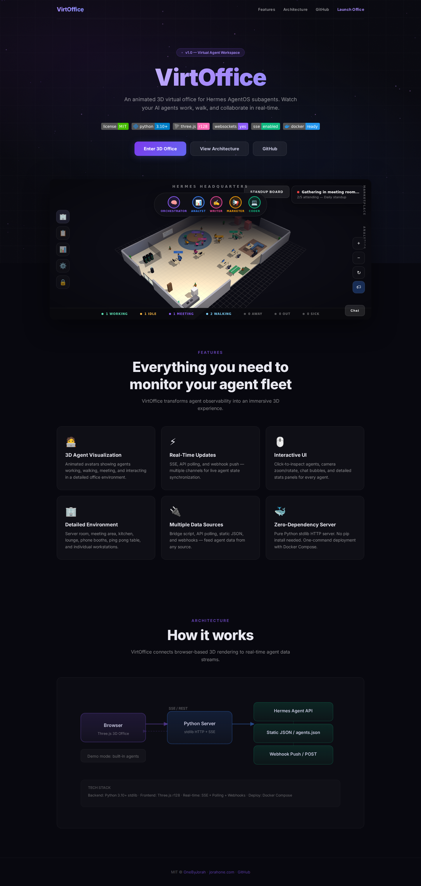
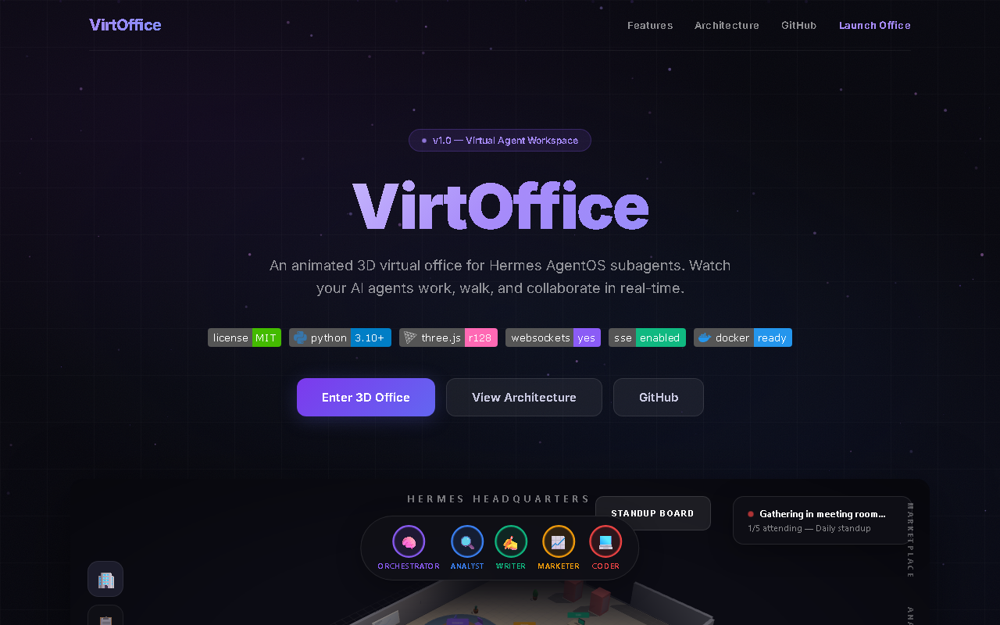
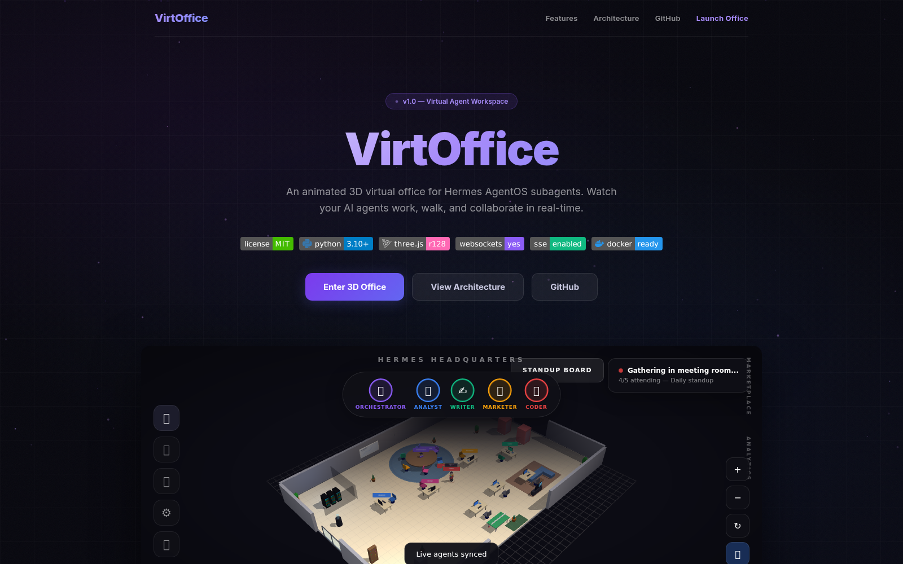
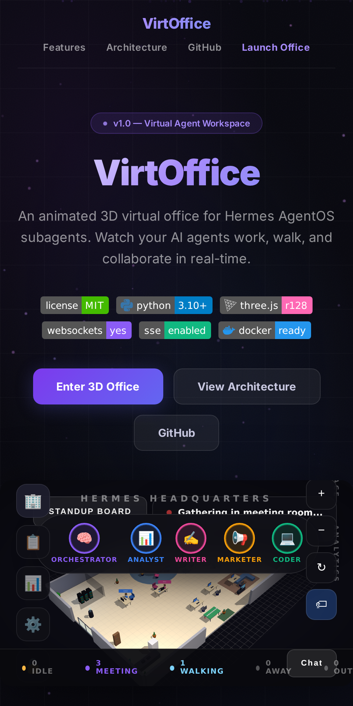

<div align="center">


# VirtOffice

**A real-time 3D virtual office that turns your AI agent fleet into animated avatars** — for teams running Hermes AgentOS subagents.

<a href="https://github.com/OneByJorah/VirtOffice/stargazers"></a>
<a href="https://github.com/OneByJorah/VirtOffice/commits"></a>
<a href="LICENSE"></a>


</div>


## What This Is

Agent dashboards usually show a table of statuses — accurate, but hard to read at a glance. VirtOffice maps each agent to an animated 3D character that works at its desk, walks to a meeting, or steps away, so the state of the fleet is visible the moment you look. It pairs a zero-dependency Python server with a Three.js floor plan and streams live state over SSE, polling, or webhooks.

## Quick Start

```bash
git clone https://github.com/OneByJorah/VirtOffice.git
cd VirtOffice
python3 server.py
```

Open **http://localhost:9502**. No `pip install` is required — the server is pure Python stdlib.

### Docker

```bash
docker compose up -d
# Open http://localhost:9502
```

## Features

- **3D agent avatars** — idle breathing, walking cycles, typing arms, and gesturing during meetings.
- **Real-time updates** — SSE, API polling, and webhook push keep the office in sync.
- **Interactive UI** — click to inspect agents, zoom/rotate the camera, and read floating chat bubbles and stats panels.
- **Rich office environment** — server room with blinking LEDs, meeting area and whiteboard, kitchen, lounge, phone booths, ping-pong table, bookshelves, and plants.
- **Multi-source data** — Hermes Agent API, a static `agents.json`, webhook push, or built-in demo mode.
- **Zero-dependency server** — Python stdlib only; no packages to install.
- **Hermes bridge** — auto-discovers agents from `~/.hermes/` and emits live JSON.
- **Docker Compose** — one-command deployment with a healthcheck.

## Data Sources

1. **Hermes Agent API** — polls a Hermes AgentOS snapshot endpoint.
2. **Static JSON** — serves agent data from `agents.json` (with an `agents.json.example` template).
3. **Webhook push** — `POST /webhook/agents` with agent payloads.
4. **Demo mode** — built-in sample agents when no source is configured.

```bash
# Emit live agent state from Hermes (one-shot, or watch every 15s)
python3 scripts/hermes_bridge.py --watch

# Push directly to a running dashboard
python3 scripts/hermes_bridge.py --webhook http://localhost:9502/webhook/agents
```

## Architecture

```
┌─────────────┐     SSE / REST poll      ┌──────────────┐   ┌─────────────────┐
│   Browser   │ ◄──────────────────────► │    Python    │ ◄─┤   Hermes API    │
│  Three.js   │                          │    Server    │   │   agents.json   │
│  3D Office  │                          │  stdlib HTTP │   │   Webhook Push  │
└─────────────┘                          └──────────────┘   └─────────────────┘
                                                 │
                                           ┌─────┴─────┐
                                           │   Demo     │
                                           │   Mode     │
                                           └───────────┘
```

## Environment Zones

| Zone | Description |
|------|-------------|
| **Server Room** | Glass-walled room with rack servers and blinking LEDs |
| **Meeting Area** | Round table with chairs, whiteboard with growth chart |
| **Kitchen** | Counter, fridge, coffee machine, microwave |
| **Lounge** | Sofa, coffee table, TV, bookshelf |
| **Workstations** | Individual desks with monitors, keyboards, personalized decor |
| **Phone Booths** | Red soundproof booths for private calls |
| **Recreation** | Ping-pong table with paddles |

## Configuration

| Variable | Default | Description |
|----------|---------|-------------|
| `PORT` | `9502` | Server port |
| `HOST` | `127.0.0.1` | Bind address (`0.0.0.0` in Docker Compose) |
| `HERMES_AGENT_API` | — | Hermes agent snapshot endpoint |
| `AGENTS_JSON_PATH` | `./agents.json` | Agents JSON file path |
| `POLL_INTERVAL_SECONDS` | `5` | API polling interval |
| `ENABLE_SSE` | `true` | Enable Server-Sent Events |

> [!NOTE]
> `.env` is read by Docker Compose. When running `python3 server.py` directly, pass configuration as environment variables instead.

## Project Structure

```
VirtOffice/
├── server.py                  # Python stdlib HTTP server (zero dependencies)
├── public/
│   ├── index.html             # Landing page
│   └── office.html            # 3D Three.js office application
├── scripts/
│   ├── hermes_bridge.py       # Hermes AgentOS integration
│   └── example_agent_emitter.py
├── agents.json                # Agent data file
├── docker-compose.yml
├── Dockerfile
└── .env.example
```

## Use Cases

1. **Agent fleet monitoring** — watch which subagents are busy, idle, or in handoff at a glance.
2. **Demos and streams** — a visual backdrop for showing an autonomous agent team working.
3. **Local dev observability** — point the bridge at `~/.hermes/` and see agent state without a terminal.

## Tech Stack

Python (stdlib HTTP server) · Three.js · Server-Sent Events · Docker · Docker Compose

## Screenshots

| View | |
|---|---|
|  |  |
|  |  |

## Contributing

Contributions are welcome. See [CONTRIBUTING.md](CONTRIBUTING.md); all contributions follow the [Code of Conduct](CODE_OF_CONDUCT.md). [Open an issue](https://github.com/OneByJorah/VirtOffice/issues).

## License

MIT — see [LICENSE](LICENSE).

## Connect

- [jorahone.com](https://jorahone.com)
- [GitHub Org](https://github.com/OneByJorah)
- [info@jorahone.com](mailto:info@jorahone.com)
