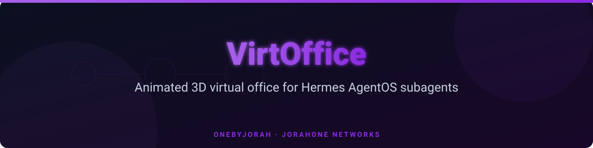
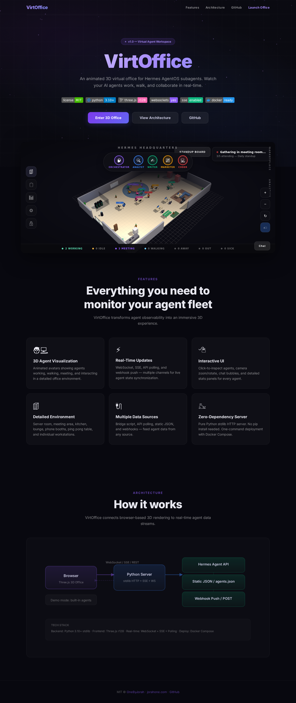

<p align="center">
  <picture>
    <source media="(prefers-color-scheme: dark)" srcset="docs/assets/banner.svg">
    
  </picture>
</p>

<h1 align="center">VirtOffice</h1>

<p align="center">
  <strong>Animated 3D virtual office for Hermes AgentOS subagents</strong>
</p>

<p align="center">
  <a href="https://github.com/OneByJorah/VirtOffice/blob/main/LICENSE"></a>
  <a href="#"></a>
  <a href="#"></a>
  <a href="#"></a>
  <a href="#"></a>
  <a href="#"></a>
  <a href="https://jorahone.com"></a>
</p>

<br>

<p align="center">
  <a href="https://github.com/OneByJorah/VirtOffice">
    
  </a>
</p>

<br>

VirtOffice is a real-time 3D virtual workspace that visualizes AI agent fleets. Each agent appears as an animated avatar in a detailed office environment — working at their desk, walking to meetings, or grabbing coffee. Built with a pure-Python stdlib server and Three.js for the browser.

---

## ✨ Features

| Feature | Description |
|---------|-------------|
| **3D Agent Avatars** | Animated characters with idle breathing, walking cycles, typing arms, and gesturing during meetings |
| **Real-Time Updates** | WebSocket, SSE (Server-Sent Events), API polling, and webhook push for live agent synchronization |
| **Interactive UI** | Click-to-inspect agents, camera zoom/rotate, floating chat bubbles, and detailed stats panels |
| **Rich Office Environment** | Server room (with blinking LEDs), meeting area with whiteboard, kitchen, lounge with TV, phone booths, ping-pong table, bookshelves, and plants |
| **Multi-Source Data** | Hermes Agent API polling, static `agents.json` file, webhook push, or built-in demo mode |
| **Zero-Dependency Server** | Pure Python stdlib — no pip install required |
| **Docker Compose** | One-command deployment |

## 🚀 Quick Start

```bash
git clone https://github.com/OneByJorah/VirtOffice.git
cd VirtOffice

cp .env.example .env
python3 server.py
```

Open **http://localhost:9502** in your browser.

### Docker

```bash
docker compose up -d
```

### Hermes Bridge

```bash
python3 scripts/hermes_bridge.py --api http://localhost:8080
```

## 🔧 Configuration

| Variable | Default | Description |
|----------|---------|-------------|
| `PORT` | `9502` | Server port |
| `HOST` | `127.0.0.1` | Bind address |
| `HERMES_AGENT_API` | — | Hermes agent snapshot endpoint |
| `AGENTS_JSON_PATH` | `./agents.json` | Agents JSON file path |
| `POLL_INTERVAL_SECONDS` | `5` | API polling interval |
| `ENABLE_SSE` | `true` | Enable Server-Sent Events |

### Data Sources

1. **Hermes Agent API** — Real-time polling of a Hermes AgentOS endpoint
2. **Static JSON** — Serve agent data from `agents.json`
3. **Webhook Push** — `POST /webhook/agents` with agent payloads
4. **Demo Mode** — Built-in sample agents (default when no source configured)

## 🏗️ Architecture

```
┌─────────────┐   WebSocket / SSE / REST   ┌──────────────┐   ┌─────────────────┐
│   Browser   │ ◄────────────────────────► │    Python    │ ◄─┤   Hermes API    │
│  Three.js   │                            │    Server    │   │   agents.json   │
│  3D Office  │                            │  stdlib HTTP │   │   Webhook Push  │
└─────────────┘                            └──────────────┘   └─────────────────┘
                                                 │
                                           ┌─────┴─────┐
                                           │   Demo     │
                                           │   Mode     │
                                           └───────────┘
```

## 📁 Project Structure

```
VirtOffice/
├── server.py                  # Python stdlib HTTP server (zero dependencies)
├── public/
│   ├── index.html             # Landing page (this page)
│   └── office.html            # 3D Three.js office application
├── scripts/
│   ├── hermes_bridge.py       # Hermes AgentOS integration
│   └── example_agent_emitter.py
├── agents.json                # Agent data file
├── docker-compose.yml
├── Dockerfile
└── .env.example
```

## 🧪 Environment Zones

The 3D office includes several distinct zones:

| Zone | Description |
|------|-------------|
| **Server Room** | Glass-walled room with rack servers and blinking LEDs |
| **Meeting Area** | Round table with chairs, whiteboard with growth chart |
| **Kitchen** | Counter, fridge, coffee machine, microwave |
| **Lounge** | Sofa, coffee table, TV, bookshelf |
| **Workstations** | Individual desks with monitors, keyboards, personalized decor |
| **Phone Booths** | Red soundproof booths for private calls |
| **Recreation** | Ping-pong table with paddles |

## 🤝 Contributing

See [CONTRIBUTING.md](CONTRIBUTING.md). All contributions follow the [Code of Conduct](CODE_OF_CONDUCT.md).

## 🔒 Security

Found a vulnerability? Please report privately to **security@jorahone.com** — see [SECURITY.md](SECURITY.md).

## 📄 License

[MIT](LICENSE) © Jhonattan L. Jimenez (OneByJorah)

---

<p align="center">
  Built with 🌴 by <a href="https://github.com/OneByJorah">OneByJorah</a> ·
  <a href="https://jorahone.com">jorahone.com</a>
</p>
