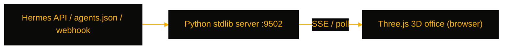

# VirtOffice

> Real-time 3D virtual office that renders your AI agent fleet as animated avatars at desks — a glanceable status view for teams running Hermes AgentOS subagents.

[](https://github.com/OneByJorah/VirtOffice)
[](https://github.com/OneByJorah/VirtOffice)
[](https://github.com/OneByJorah/VirtOffice/stargazers)
[](https://github.com/OneByJorah/VirtOffice/commits)
[](https://github.com/OneByJorah/VirtOffice/actions)

## What This Is

Agent dashboards show a table of statuses — accurate, but you have to read it. VirtOffice maps each agent to a 3D character that types at its desk, walks to a meeting, or steps away, so fleet state is visible the second you look. It pairs a zero-dependency Python-stdlib server with a Three.js floor plan and streams state over SSE, polling, or webhooks. It is built for developers running multi-agent setups who want ambient observability without building their own frontend.

## Quick Start

```bash
git clone https://github.com/OneByJorah/VirtOffice.git && cd VirtOffice
python3 server.py        # or: docker compose up -d
```

Open **http://localhost:9502**. No `pip install` — the server is pure Python stdlib.

## Features

- 3D avatars with idle, walking, typing, and meeting animations mapped to agent state
- Live updates via Server-Sent Events, REST polling, or `POST /webhook/agents` push
- Four data sources: Hermes Agent API, static `agents.json`, webhook push, or built-in demo mode
- `scripts/hermes_bridge.py` auto-discovers agents from `~/.hermes/` and emits live JSON
- Interactive Three.js office: zoom/rotate camera, click agents, floating chat bubbles and stats panels
- Detailed environment — server room with blinking LEDs, meeting area, kitchen, lounge, phone booths
- Zero install: single-file Python stdlib HTTP server, or one-command Docker Compose with healthcheck

## Architecture



## Stack

Python (stdlib HTTP server — no dependencies), Three.js, Server-Sent Events, Docker Compose.

## Contributing

Contributions are welcome — read [CONTRIBUTING.md](CONTRIBUTING.md), then [open an issue](https://github.com/OneByJorah/VirtOffice/issues).

## License

MIT — see LICENSE.
